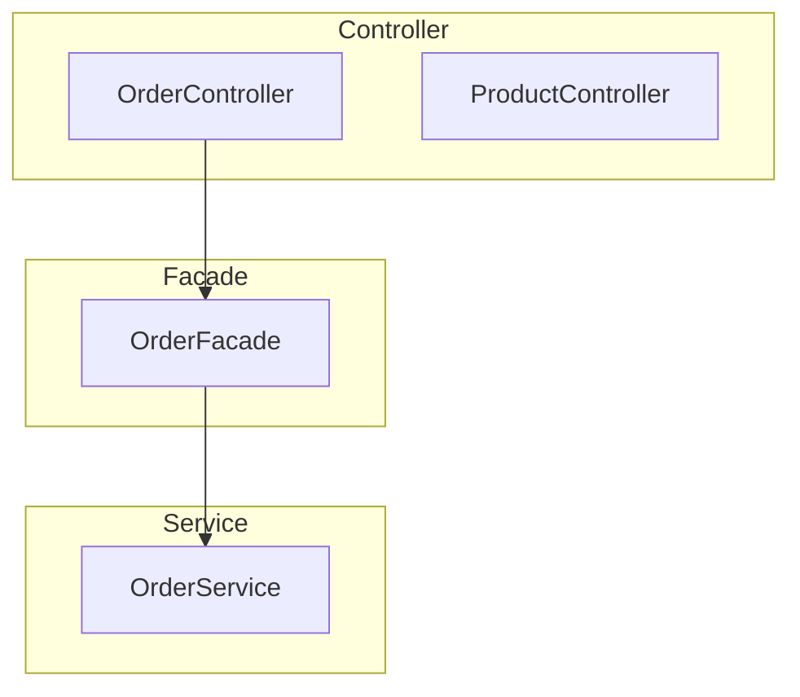

# Code-GraphRAG 应用架构树生成器 - 需求规格文档 (SPEC)

## 一、需求背景

当前系统已实现：
- Java 代码解析（类、方法提取）
- 调用关系图谱（Neo4j: Class/Method 节点 + CALLS/BELONGS_TO 关系）
- 向量语义搜索（ChromaDB）

**目标**：基于图数据库生成多层级应用架构树（Tree），支持不同粒度的代码概览，实现数据流/调用链的可视化。

---

## 二、核心概念设计

### 2.1 Tree Level 定义（层级架构）

| Level | 层级名称 | 描述 | 节点类型 | 示例 |
|-------|---------|------|---------|------|
| L0 | 系统根节点 | 应用/项目入口 | System | OrderSystem |
| L1 | 包/模块 | 按目录或业务分包 | Package | controller, service, dal |
| L2 | 类 | 具体业务类 | Class | OrderService, UserDao |
| L3 | 方法 | 类中的方法 | Method | placeOrder(), createUser() |
| L4 | 代码片段 | 方法内具体逻辑 | CodeBlock | 循环/条件块（可选） |

### 2.2 架构分层模式（Java 典型）

基于项目现有的关键词过滤规则，支持以下分层：

```
┌─────────────────────────────────────────────┐
│  L1: Controller 层 (action/controller)      │
├─────────────────────────────────────────────┤
│  L1: Facade 层 (facade)                      │
├─────────────────────────────────────────────┤
│  L1: Service 层 (service)                    │
├─────────────────────────────────────────────┤
│  L1: Biz 层 (biz/bl)                         │
├─────────────────────────────────────────────┤
│  L1: DAL 层 (dal/dao/repository)             │
├─────────────────────────────────────────────┤
│  L1: Model 层 (model/entity/vo)              │
└─────────────────────────────────────────────┘
```

---

## 三、功能需求

### 3.1 架构树生成器 (ArchitectureTreeGenerator)

**输入**：项目根路径 或 Neo4j 图数据

**输出**：多层级树结构 JSON，包含：
- 层级路径（path）
- 节点统计（count）
- 聚合摘要（summary）
- 完整调用链（call_chain）

### 3.2 核心接口设计

```python
class ArchitectureTreeGenerator:
    def generate_layer_tree(self) -> Dict:
        """生成按层级（Controller/Service/Facade/Biz/DAL）组织的树"""
        
    def generate_package_tree(self) -> Dict:
        """生成按包目录组织的树"""
        
    def generate_call_chain_tree(self, entry_method: str) -> Dict:
        """从入口方法向下游生成完整调用链树"""
        
    def get_tree_summary(self, level: int) -> str:
        """获取指定层级的汇总信息"""
        
    def export_tree_json(self, output_path: str):
        """导出树结构为 JSON 文件"""
        
    def export_architecture_diagram(self, format: str):
        """导出为 Mermaid/PlantUML 格式"""
```

### 3.3 数据流可视化

- **入口点分析**：找到被外部 HTTP/RPC 调用的方法（Controller 层方法）
- **下游链路**：从入口向下追踪完整的调用链
- **上游依赖**：从方法向上追踪被哪些方法调用

---

## 四、Neo4j 图结构扩展

### 4.1 现有结构（已实现）

```cypher
(:Class {name, file_path})
(:Method {name, class_name, file_path})
(:Method)-[:CALLS {type}]->(:Method)
(:Method)-[:BELONGS_TO]->(:Class)
```

### 4.2 需新增结构

```cypher
# 包/模块节点
(:Layer {name: 'controller', type: 'layer'})
(:Layer)-[:CONTAINS]->(:Class)

# 调用链路径
(:Method)-[:CALL_PATH {depth}]->(:Method)

# 聚合统计
(:Package {name, class_count, method_count})
```

### 4.3 核心查询接口

```python
class GraphQueryService:
    def get_layer_statistics(self) -> List[Dict]:
        """获取各层级统计信息"""
        
    def get_class_by_layer(self, layer: str) -> List[Dict]:
        """获取指定层级的所有类"""
        
    def get_entry_methods(self) -> List[Dict]:
        """获取入口方法（Controller层方法）"""
        
    def get_downstream_calls(self, method_name: str, depth: int = 5) -> List[Dict]:
        """获取下游调用链"""
        
    def get_upstream_callers(self, method_name: str) -> List[Dict]:
        """获取上游调用者"""
        
    def get_data_flow_path(self, start_method: str, end_method: str) -> List[Dict]:
        """获取两点之间的数据流路径"""
```

---

## 五、输出格式设计

### 5.1 JSON 树结构

```json
{
  "system": "OrderSystem",
  "layers": [
    {
      "layer": "controller",
      "classes": [
        {
          "name": "OrderController",
          "methods": ["placeOrder", "getOrder"],
          "calls_to": ["OrderFacade"],
          "summary": "订单 HTTP 接口层，处理用户下单请求"
        }
      ]
    }
  ],
  "call_chains": [
    {
      "entry": "OrderController.placeOrder",
      "path": [
        "OrderController.placeOrder",
        "OrderFacade.createOrder",
        "OrderService.create",
        "OrderBiz.validate",
        "OrderDal.insert"
      ],
      "depth": 5
    }
  ]
}
```

### 5.2 Mermaid 架构图



---

## 六、实现计划

### Phase 1: 基础架构树生成
- [ ] 新增 `ArchitectureTreeGenerator` 类
- [ ] 实现 `generate_layer_tree()` 按层级组织
- [ ] 实现 `generate_package_tree()` 按包组织

### Phase 2: 调用链分析
- [ ] 实现入口方法识别（Controller 层）
- [ ] 实现下游/上游调用链追踪
- [ ] 支持深度限制和路径剪枝

### Phase 3: 可视化导出
- [ ] 支持 JSON 导出
- [ ] 支持 Mermaid 格式导出
- [ ] 支持 PlantUML 格式导出

### Phase 4: 集成与优化
- [ ] 集成到 main.py 流水线
- [ ] 添加缓存机制
- [ ] 支持增量更新

---

## 七、技术约束

- Neo4j 查询深度限制：默认 10 层
- 单次查询超时：30 秒
- 树节点最大数量：1000（可配置）
- 支持 Java 项目分析（后续可扩展其他语言）

---

## 八、验收标准

1. **层级树生成**：能够正确按 Controller/Service/Facade/Biz/DAL 分层
2. **调用链完整**：从入口方法可追溯完整下游调用链
3. **数据对应**：树节点与 Neo4j 图节点一一对应
4. **导出可用**：Mermaid 格式可被主流 Markdown 工具渲染
5. **性能要求**：100 个类以内的项目，生成树结构不超过 10 秒
