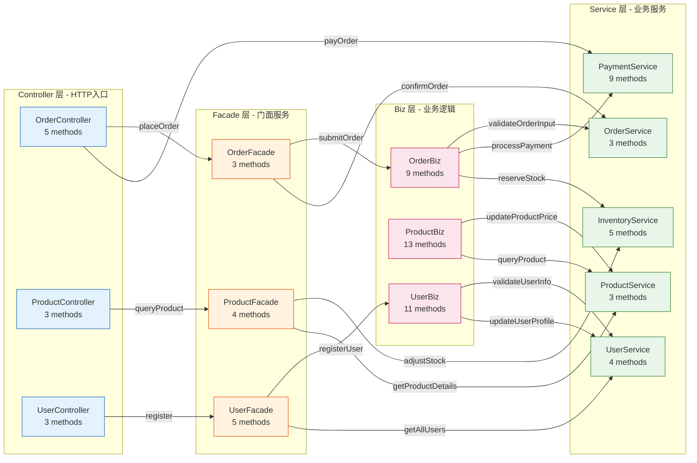

```mermaid
graph LR
    %% Java Project Architecture Overview

    subgraph CONTROLLER [Controller 层 - HTTP入口]
        OC[OrderController<br/>5 methods]
        PC[ProductController<br/>3 methods]
        UC[UserController<br/>3 methods]
    end

    subgraph FACADE [Facade 层 - 门面服务]
        OF[OrderFacade<br/>3 methods]
        PF[ProductFacade<br/>4 methods]
        UF[UserFacade<br/>5 methods]
    end

    subgraph SERVICE [Service 层 - 业务服务]
        PayS[PaymentService<br/>9 methods]
        OS[OrderService<br/>3 methods]
        PS[ProductService<br/>3 methods]
        US[UserService<br/>4 methods]
        IS[InventoryService<br/>5 methods]
    end

    subgraph BIZ [Biz 层 - 业务逻辑]
        OB[OrderBiz<br/>9 methods]
        PB[ProductBiz<br/>13 methods]
        UB[UserBiz<br/>11 methods]
    end

    %% 调用关系
    OC -->|placeOrder| OF
    OC -->|payOrder| PayS
    PC -->|queryProduct| PF
    UC -->|register| UF

    OF -->|submitOrder| OB
    OF -->|confirmOrder| OS
    PF -->|adjustStock| IS
    PF -->|getProductDetails| PS
    UF -->|registerUser| UB
    UF -->|getAllUsers| US

    OB -->|validateOrderInput| OS
    OB -->|processPayment| PayS
    OB -->|reserveStock| IS
    PB -->|updateProductPrice| PS
    PB -->|queryProduct| PS
    UB -->|validateUserInfo| US
    UB -->|updateUserProfile| US

    classDef controller fill:#e3f2fd,stroke:#1565c0
    classDef facade fill:#fff3e0,stroke:#e65100
    classDef service fill:#e8f5e9,stroke:#2e7d32
    classDef biz fill:#fce4ec,stroke:#c2185b

    class OC,PC,UC controller
    class OF,PF,UF facade
    class PayS,OS,PS,US,IS service
    class OB,PB,UB biz
```
