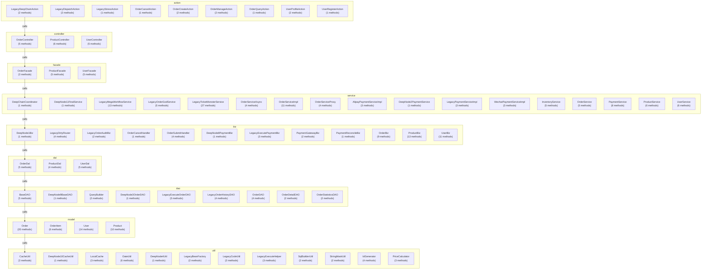

```mermaid
graph TD
    subgraph action
        LegacyDeepChainAction["LegacyDeepChainAction<br/>(2 methods)"]
        LegacyDispatchAction["LegacyDispatchAction<br/>(2 methods)"]
        LegacyStressAction["LegacyStressAction<br/>(1 methods)"]
        OrderCancelAction["OrderCancelAction<br/>(1 methods)"]
        OrderCreateAction["OrderCreateAction<br/>(2 methods)"]
        OrderManageAction["OrderManageAction<br/>(2 methods)"]
        OrderQueryAction["OrderQueryAction<br/>(1 methods)"]
        UserProfileAction["UserProfileAction<br/>(2 methods)"]
        UserRegisterAction["UserRegisterAction<br/>(1 methods)"]
    end

    subgraph controller
        OrderController["OrderController<br/>(5 methods)"]
        ProductController["ProductController<br/>(6 methods)"]
        UserController["UserController<br/>(5 methods)"]
    end

    subgraph facade
        OrderFacade["OrderFacade<br/>(3 methods)"]
        ProductFacade["ProductFacade<br/>(5 methods)"]
        UserFacade["UserFacade<br/>(5 methods)"]
    end

    subgraph service
        DeepChainCoordinator["DeepChainCoordinator<br/>(1 methods)"]
        DeepNode11FinalService["DeepNode11FinalService<br/>(1 methods)"]
        LegacyMegaWorkflowService["LegacyMegaWorkflowService<br/>(13 methods)"]
        LegacyOrderGodService["LegacyOrderGodService<br/>(5 methods)"]
        LegacyTicketMonsterService["LegacyTicketMonsterService<br/>(27 methods)"]
        OrderServiceAsync["OrderServiceAsync<br/>(4 methods)"]
        OrderServiceImpl["OrderServiceImpl<br/>(11 methods)"]
        OrderServiceProxy["OrderServiceProxy<br/>(4 methods)"]
        AlipayPaymentServiceImpl["AlipayPaymentServiceImpl<br/>(3 methods)"]
        DeepNode2PaymentService["DeepNode2PaymentService<br/>(1 methods)"]
        LegacyPaymentServiceImpl["LegacyPaymentServiceImpl<br/>(3 methods)"]
        WechatPaymentServiceImpl["WechatPaymentServiceImpl<br/>(3 methods)"]
        InventoryService["InventoryService<br/>(5 methods)"]
        OrderService["OrderService<br/>(5 methods)"]
        PaymentService["PaymentService<br/>(8 methods)"]
        ProductService["ProductService<br/>(6 methods)"]
        UserService["UserService<br/>(6 methods)"]
    end

    subgraph biz
        DeepNode1Biz["DeepNode1Biz<br/>(1 methods)"]
        LegacyDirtyRouter["LegacyDirtyRouter<br/>(4 methods)"]
        LegacyOrderAuditBiz["LegacyOrderAuditBiz<br/>(2 methods)"]
        OrderCancelHandler["OrderCancelHandler<br/>(1 methods)"]
        OrderSubmitHandler["OrderSubmitHandler<br/>(4 methods)"]
        DeepNode8PaymentBiz["DeepNode8PaymentBiz<br/>(1 methods)"]
        LegacyExecutePaymentBiz["LegacyExecutePaymentBiz<br/>(3 methods)"]
        PaymentGatewayBiz["PaymentGatewayBiz<br/>(2 methods)"]
        PaymentReconcileBiz["PaymentReconcileBiz<br/>(1 methods)"]
        OrderBiz["OrderBiz<br/>(9 methods)"]
        ProductBiz["ProductBiz<br/>(13 methods)"]
        UserBiz["UserBiz<br/>(11 methods)"]
    end

    subgraph dal
        OrderDal["OrderDal<br/>(5 methods)"]
        ProductDal["ProductDal<br/>(4 methods)"]
        UserDal["UserDal<br/>(5 methods)"]
    end

    subgraph dao
        BaseDAO["BaseDAO<br/>(5 methods)"]
        DeepNode9BaseDAO["DeepNode9BaseDAO<br/>(1 methods)"]
        QueryBuilder["QueryBuilder<br/>(2 methods)"]
        DeepNode3OrderDAO["DeepNode3OrderDAO<br/>(1 methods)"]
        LegacyExecuteOrderDAO["LegacyExecuteOrderDAO<br/>(3 methods)"]
        LegacyOrderHistoryDAO["LegacyOrderHistoryDAO<br/>(4 methods)"]
        OrderDAO["OrderDAO<br/>(4 methods)"]
        OrderDetailDAO["OrderDetailDAO<br/>(2 methods)"]
        OrderStatisticsDAO["OrderStatisticsDAO<br/>(2 methods)"]
    end

    subgraph model
        Order["Order<br/>(20 methods)"]
        OrderItem["OrderItem<br/>(6 methods)"]
        User["User<br/>(14 methods)"]
        Order["Order<br/>(20 methods)"]
        Product["Product<br/>(10 methods)"]
        User["User<br/>(14 methods)"]
    end

    subgraph util
        CacheUtil["CacheUtil<br/>(3 methods)"]
        DeepNode10CacheUtil["DeepNode10CacheUtil<br/>(1 methods)"]
        LocalCache["LocalCache<br/>(3 methods)"]
        DateUtil["DateUtil<br/>(6 methods)"]
        DeepNode4Util["DeepNode4Util<br/>(1 methods)"]
        LegacyBeanFactory["LegacyBeanFactory<br/>(2 methods)"]
        LegacyCodeUtil["LegacyCodeUtil<br/>(2 methods)"]
        LegacyExecuteHelper["LegacyExecuteHelper<br/>(3 methods)"]
        SqlBuilderUtil["SqlBuilderUtil<br/>(2 methods)"]
        StringMaskUtil["StringMaskUtil<br/>(2 methods)"]
        DateUtil["DateUtil<br/>(6 methods)"]
        IdGenerator["IdGenerator<br/>(4 methods)"]
        PriceCalculator["PriceCalculator<br/>(3 methods)"]
    end

    LegacyDeepChainAction -->|calls| OrderController
    OrderController -->|calls| OrderFacade
    OrderFacade -->|calls| DeepChainCoordinator
    DeepChainCoordinator -->|calls| DeepNode1Biz
    DeepNode1Biz -->|calls| OrderDal
    OrderDal -->|calls| BaseDAO
    BaseDAO -->|calls| Order
    Order -->|calls| CacheUtil
```