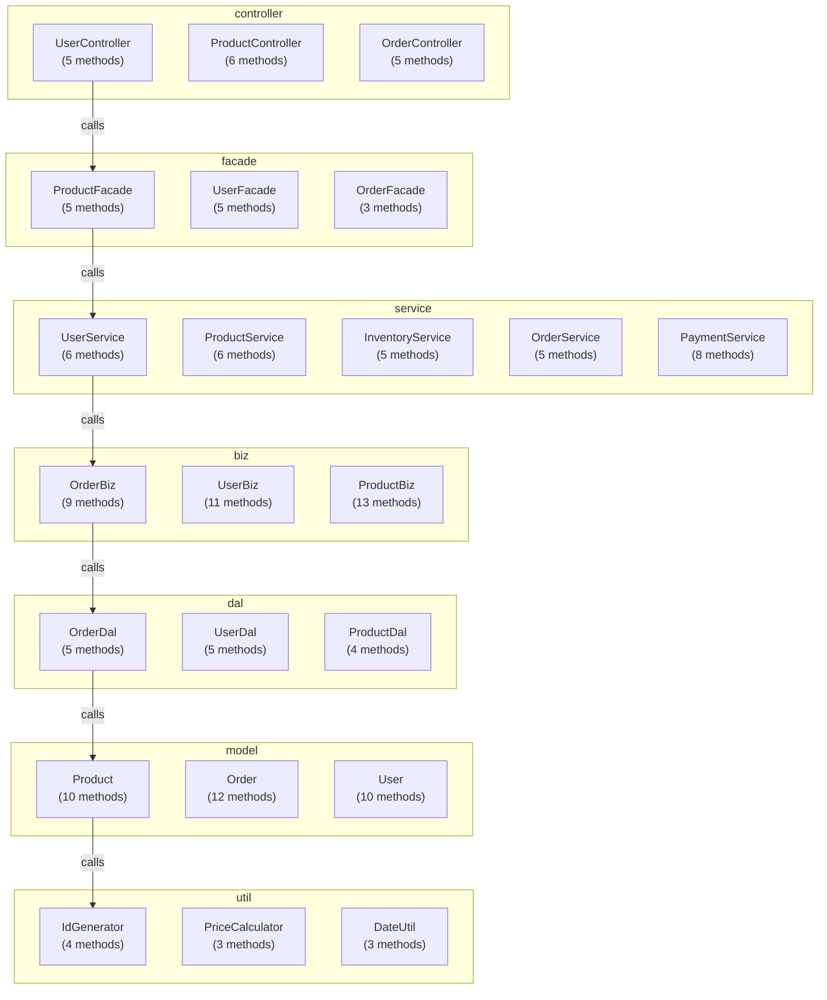

```mermaid
graph TD
    subgraph controller
        UserController["UserController<br/>(5 methods)"]
        ProductController["ProductController<br/>(6 methods)"]
        OrderController["OrderController<br/>(5 methods)"]
    end

    subgraph facade
        ProductFacade["ProductFacade<br/>(5 methods)"]
        UserFacade["UserFacade<br/>(5 methods)"]
        OrderFacade["OrderFacade<br/>(3 methods)"]
    end

    subgraph service
        UserService["UserService<br/>(6 methods)"]
        ProductService["ProductService<br/>(6 methods)"]
        InventoryService["InventoryService<br/>(5 methods)"]
        OrderService["OrderService<br/>(5 methods)"]
        PaymentService["PaymentService<br/>(8 methods)"]
    end

    subgraph biz
        OrderBiz["OrderBiz<br/>(9 methods)"]
        UserBiz["UserBiz<br/>(11 methods)"]
        ProductBiz["ProductBiz<br/>(13 methods)"]
    end

    subgraph dal
        OrderDal["OrderDal<br/>(5 methods)"]
        UserDal["UserDal<br/>(5 methods)"]
        ProductDal["ProductDal<br/>(4 methods)"]
    end

    subgraph model
        Product["Product<br/>(10 methods)"]
        Order["Order<br/>(12 methods)"]
        User["User<br/>(10 methods)"]
    end

    subgraph util
        IdGenerator["IdGenerator<br/>(4 methods)"]
        PriceCalculator["PriceCalculator<br/>(3 methods)"]
        DateUtil["DateUtil<br/>(3 methods)"]
    end

    UserController -->|calls| ProductFacade
    ProductFacade -->|calls| UserService
    UserService -->|calls| OrderBiz
    OrderBiz -->|calls| OrderDal
    OrderDal -->|calls| Product
    Product -->|calls| IdGenerator
```