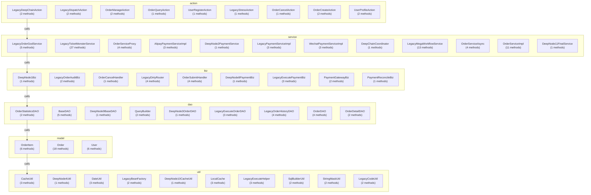

```mermaid
graph TD
    subgraph action
        LegacyDeepChainAction["LegacyDeepChainAction<br/>(2 methods)"]
        LegacyDispatchAction["LegacyDispatchAction<br/>(2 methods)"]
        OrderManageAction["OrderManageAction<br/>(2 methods)"]
        OrderQueryAction["OrderQueryAction<br/>(1 methods)"]
        UserRegisterAction["UserRegisterAction<br/>(1 methods)"]
        LegacyStressAction["LegacyStressAction<br/>(1 methods)"]
        OrderCancelAction["OrderCancelAction<br/>(1 methods)"]
        OrderCreateAction["OrderCreateAction<br/>(2 methods)"]
        UserProfileAction["UserProfileAction<br/>(2 methods)"]
    end

    subgraph service
        LegacyOrderGodService["LegacyOrderGodService<br/>(5 methods)"]
        LegacyTicketMonsterService["LegacyTicketMonsterService<br/>(27 methods)"]
        OrderServiceProxy["OrderServiceProxy<br/>(4 methods)"]
        AlipayPaymentServiceImpl["AlipayPaymentServiceImpl<br/>(3 methods)"]
        DeepNode2PaymentService["DeepNode2PaymentService<br/>(1 methods)"]
        LegacyPaymentServiceImpl["LegacyPaymentServiceImpl<br/>(3 methods)"]
        WechatPaymentServiceImpl["WechatPaymentServiceImpl<br/>(3 methods)"]
        DeepChainCoordinator["DeepChainCoordinator<br/>(1 methods)"]
        LegacyMegaWorkflowService["LegacyMegaWorkflowService<br/>(13 methods)"]
        OrderServiceAsync["OrderServiceAsync<br/>(4 methods)"]
        OrderServiceImpl["OrderServiceImpl<br/>(11 methods)"]
        DeepNode11FinalService["DeepNode11FinalService<br/>(1 methods)"]
    end

    subgraph biz
        DeepNode1Biz["DeepNode1Biz<br/>(1 methods)"]
        LegacyOrderAuditBiz["LegacyOrderAuditBiz<br/>(2 methods)"]
        OrderCancelHandler["OrderCancelHandler<br/>(1 methods)"]
        LegacyDirtyRouter["LegacyDirtyRouter<br/>(4 methods)"]
        OrderSubmitHandler["OrderSubmitHandler<br/>(4 methods)"]
        DeepNode8PaymentBiz["DeepNode8PaymentBiz<br/>(1 methods)"]
        LegacyExecutePaymentBiz["LegacyExecutePaymentBiz<br/>(3 methods)"]
        PaymentGatewayBiz["PaymentGatewayBiz<br/>(2 methods)"]
        PaymentReconcileBiz["PaymentReconcileBiz<br/>(1 methods)"]
    end

    subgraph dao
        OrderStatisticsDAO["OrderStatisticsDAO<br/>(2 methods)"]
        BaseDAO["BaseDAO<br/>(5 methods)"]
        DeepNode9BaseDAO["DeepNode9BaseDAO<br/>(1 methods)"]
        QueryBuilder["QueryBuilder<br/>(2 methods)"]
        DeepNode3OrderDAO["DeepNode3OrderDAO<br/>(1 methods)"]
        LegacyExecuteOrderDAO["LegacyExecuteOrderDAO<br/>(3 methods)"]
        LegacyOrderHistoryDAO["LegacyOrderHistoryDAO<br/>(4 methods)"]
        OrderDAO["OrderDAO<br/>(4 methods)"]
        OrderDetailDAO["OrderDetailDAO<br/>(2 methods)"]
    end

    subgraph model
        OrderItem["OrderItem<br/>(6 methods)"]
        Order["Order<br/>(18 methods)"]
        User["User<br/>(6 methods)"]
    end

    subgraph util
        CacheUtil["CacheUtil<br/>(3 methods)"]
        DeepNode4Util["DeepNode4Util<br/>(1 methods)"]
        DateUtil["DateUtil<br/>(3 methods)"]
        LegacyBeanFactory["LegacyBeanFactory<br/>(2 methods)"]
        DeepNode10CacheUtil["DeepNode10CacheUtil<br/>(1 methods)"]
        LocalCache["LocalCache<br/>(3 methods)"]
        LegacyExecuteHelper["LegacyExecuteHelper<br/>(3 methods)"]
        SqlBuilderUtil["SqlBuilderUtil<br/>(2 methods)"]
        StringMaskUtil["StringMaskUtil<br/>(2 methods)"]
        LegacyCodeUtil["LegacyCodeUtil<br/>(2 methods)"]
    end

    LegacyDeepChainAction -->|calls| LegacyOrderGodService
    LegacyOrderGodService -->|calls| DeepNode1Biz
    DeepNode1Biz -->|calls| OrderStatisticsDAO
    OrderStatisticsDAO -->|calls| OrderItem
    OrderItem -->|calls| CacheUtil
```